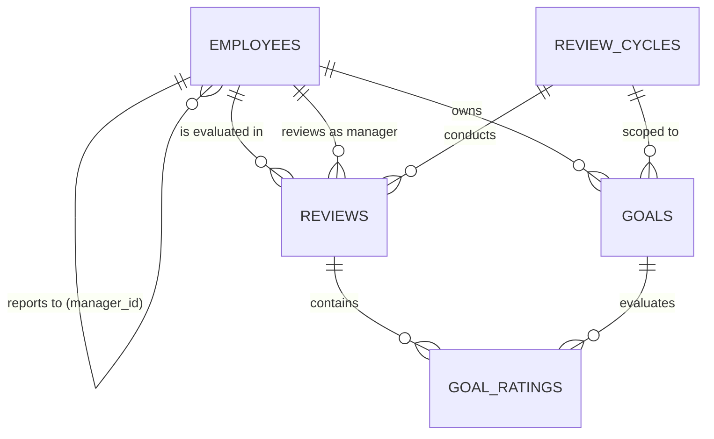

# AI PMS — Performance Management System

An enterprise-grade **Performance Management System (PMS)** built for mid-sized services organizations (~200 employees) to replace chaotic spreadsheet-based annual appraisals with structured, auditable, and calibrated evaluation cycles.


---

## 🌟 Key Features & Workflow

### 1. Unified Employee Reporting Line
- Single `employees` table with self-referencing `manager_id -> employees.id`.
- Role-Aware Access Control (RBAC):
  - **Employee**: Set SMART goals, submit for manager approval, complete self-appraisals with 1-5 ratings.
  - **Manager**: Review/approve direct reports' goals, side-by-side performance appraisal with manager comments & ratings.
  - **HR Admin**: Create/open/close review cycles, manage personnel directory, monitor company-wide completion matrix.

### 2. Strict Goal Alignment (100% Weightage Rule)
- Real-time frontend and database validation requiring $\sum \text{weightage} = 100\%$ before submission is unlocked.
- Structured lifecycle: `Draft` $\to$ `Submitted` $\to$ `Approved` (or `Sent Back` with feedback).

### 3. Side-by-Side Dual Perspective Appraisal
- Split-screen review UX: Employee's self-ratings & achievement comments on the left; Manager's evaluation and ratings on the right.
- Status pipeline: `Not Started` $\to$ `Self-Appraisal Submitted` $\to$ `Manager Reviewed` $\to$ `Completed`.

### 4. Non-Blocking Transactional Email Notifications
- Automated email alerts to managers via **Resend SDK** on self-appraisal submissions.
- Server-side API endpoint (`/api/notify-manager`) with try-catch isolation.

---

## 📐 Architecture & Data Model



### Table Relationships Rationale:
1. `employees.manager_id` $\to$ `employees.id`: Represents manager hierarchy without table duplication.
2. `goals.cycle_id` $\to$ `review_cycles.id`: Strictly prevents goals from mixing across different appraisal years.
3. `reviews.employee_id` & `reviews.cycle_id`: Unique compound constraint ensuring exactly one review container per employee per cycle.
4. `goal_ratings`: Separates the goal definition (the plan) from the evaluation ratings (the outcome).

---

## 🚀 Getting Started Locally

### 1. Prerequisites
- **Node.js**: v20.x or higher
- **npm**: v10.x or higher
- **Git**

### 2. Clone and Install Dependencies
```bash
git clone https://github.com/<your-username>/pms-app.git
cd pms-app
npm install
```

### 3. Environment Variables Configuration
Copy `.env.example` to `.env.local`:
```bash
cp .env.example .env.local
```

Populate the keys in `.env.local`:
```env
# Supabase
NEXT_PUBLIC_SUPABASE_URL=https://your-project.supabase.co
NEXT_PUBLIC_SUPABASE_ANON_KEY=your-supabase-anon-key

# Clerk Authentication
NEXT_PUBLIC_CLERK_PUBLISHABLE_KEY=pk_test_...
CLERK_SECRET_KEY=sk_test_...

# Resend Transactional Email
RESEND_API_KEY=re_...
EMAIL_FROM_ADDRESS=onboarding@resend.dev
```

### 4. Setup Database Schema in Supabase
1. Create a project at [supabase.com](https://supabase.com).
2. Open the **SQL Editor** in the Supabase Dashboard.
3. Paste and execute the contents of `supabase/schema.sql`.
4. Paste and execute `supabase/seed.sql` to populate initial demo data.

### 5. Run the Local Development Server
```bash
npm run dev
```
Open [http://localhost:3000](http://localhost:3000) in your browser.

---

## 👥 Demo Personas (Preloaded Credentials)

Use the one-click persona switcher on the top navigation bar to test all user roles:

| Persona | Email | Role | Responsibilities |
| :--- | :--- | :--- | :--- |
| **Praveen Dalal** | `admin@company.com` | **HR Admin** | Manage cycles, directory, and view completion audits |
| **Mehmood Sayed** | `manager@company.com` | **Manager** | Approve direct reports' goals & conduct side-by-side reviews |
| **Aarya Shirodkar** | `aarya@company.com` | **Employee (Eng)** | Set 100% goals, complete self-appraisals |
| **Uraj Madkaikar** | `uraj@company.com` | **Employee (Frontend)** | Direct report under Mehmood Sayed |
| **Unregistered User** | `guest@external.com` | *Fallback Test* | Tests "Your account is not yet set up. Please contact HR." |

---

## ☁️ Deployment on Vercel

1. Push your repository to GitHub.
2. Sign in to [Vercel](https://vercel.com) and click **Add New $\to$ Project**.
3. Import your `pms-app` repository.
4. Under **Environment Variables**, add:
   - `NEXT_PUBLIC_SUPABASE_URL`
   - `NEXT_PUBLIC_SUPABASE_ANON_KEY`
   - `NEXT_PUBLIC_CLERK_PUBLISHABLE_KEY`
   - `CLERK_SECRET_KEY`
   - `RESEND_API_KEY`
5. Click **Deploy**.
