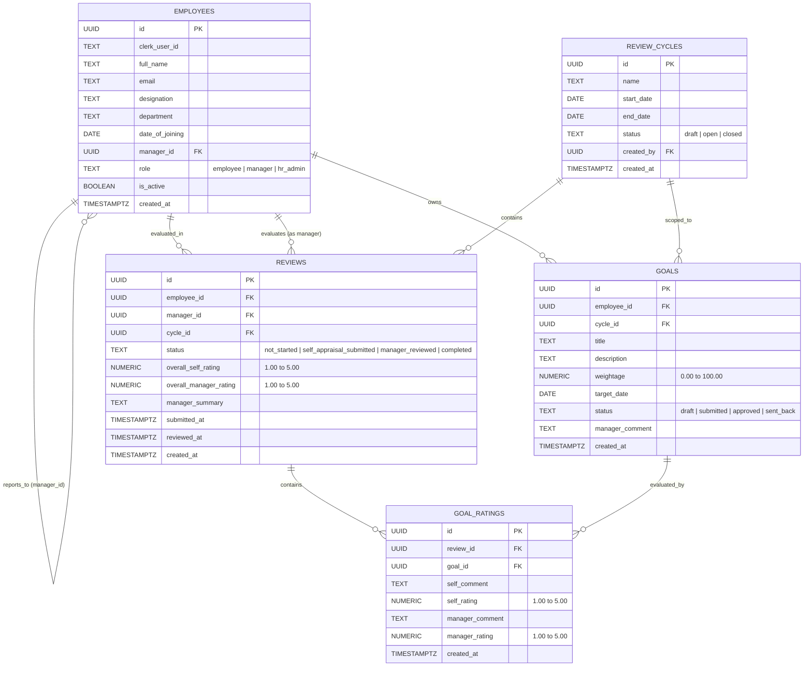

# Research Note: Performance Management Systems (PMS)

## 1. KRA vs. KPI vs. Goal
* **KRA (Key Result Area):** Broad areas of accountability or output for a specific role. Example for a Senior Engineer: *System Architecture & Scalability*.
* **KPI (Key Performance Indicator):** Quantifiable metrics used to measure performance against a KRA. Example for a Senior Engineer: *Maintain API microservices uptime at 99.9%*.
* **Goal (Objective):** A specific, time-bound target set for a cycle. Example for a Senior Engineer: *Migrate core billing services to a microservices architecture by Q3 with zero downtime*.

---

## 2. SMART Goals and Bad Goals
* **SMART** stands for **S**pecific, **M**easurable, **A**chievable, **R**elevant, and **T**ime-bound.
* **Badly Written Goal:** Vague, unmeasurable, or lacks a deadline (e.g., *"Do better code reviews and help the team"*). It fails because neither the employee nor the manager can objectively verify whether it was achieved.
* **Good SMART Goal:** *"Conduct 100% of pull request reviews within 4 business hours and deliver 2 brown-bag architectural sessions on Next.js 14 server actions by end of Q3."*

---

## 3. Performance Appraisal Cycle Stages
A typical enterprise cycle moves through the following stages:
1. **Cycle Setup & Goal Setting:** HR opens the cycle; employees define and allocate goal weightages (scaled to 100% capacity with an 85% valid threshold); managers approve or send back goals.
2. **Self-Appraisal:** Employees evaluate their performance against approved goals using a 1–5 rating scale and reflective evidence comments.
3. **Manager Review & Calibration:** Managers evaluate direct reports side-by-side, assign manager ratings, and provide executive calibration feedback.
4. **Sign-off & Closure:** Final ratings are recorded, official 3-party PDF reports are exported, and HR closes the cycle.

---

## 4. Purpose of Self-Appraisals
Organisations ask employees for self-appraisals first to encourage self-reflection, bridge gaps in perception between employees and managers during 1-on-1s, ensure achievements that a manager might have missed are brought to light, and create an active, two-way dialogue rather than a top-down judgment.

---

## 5. Rating Scales Comparison
* **3-Point Scale:** (e.g., *Needs Improvement*, *Meets Expectations*, *Exceeds Expectations*). Simple, but forces clustering and lacks granularity.
* **4-Point Scale:** Removes the neutral middle option (*forced choice*), preventing managers from copping out with average ratings.
* **5-Point Scale:** (e.g., *1 to 5*). Standard, highly granular, balances differentiation, but prone to central tendency bias if managers default to '3'. Companies avoid the middle option (or use 4/6 scales) specifically to force managers to take a stand on whether performance was above or below par.

---

## 6. Normalization, Calibration, and the Bell Curve
* **Normalization/Calibration:** A process where managers meet across departments to review ratings, align grading standards, and eliminate supervisor bias (lenient vs. harsh graders).
* **Bell Curve (Forced Distribution):** Forcing a fixed percentage of employees into top (e.g., 10%), middle (70%), and bottom (20%) performance buckets. It is controversial because it can damage morale, penalize high-performing teams, and foster unhealthy internal competition.

---

## 7. OKRs vs. Traditional KRAs
* **OKR (Objectives and Key Results):** Agile, often quarterly, aspirational, stretch targets (70% achievement is considered good), usually decoupled from direct compensation to encourage innovation.
* **Traditional KRAs:** Annual, operational, baseline expectations directly tied to job descriptions, bonuses, and salary increments.

---

## 8. Market PMS Products
* **Examples:** Lattice, Culture Amp, Workday Talent, 15Five.
* **Common Screens:** Goal setting hub, 1-on-1 meeting agendas, self/manager review evaluation forms, and HR analytics dashboards.
* **Pros/Cons:** Lattice offers great UX and goal tracking, but can become bloated and expensive for mid-sized services firms.

---

## 9. Sensitive Data in a PMS
* **Sensitive Data:** Compensation data, bonus recommendations, promotional readiness notes, disciplinary feedback, and peer-to-peer confidential remarks.
* **Access Control:** Restricted strictly to the employee themselves, their direct line manager, and HR Admins. Regular peers or unassigned managers must never be able to access this data via broken object-level authorization (BOLA) or direct URL manipulation.

---

## 10. Relational Data Model (Supabase / PostgreSQL)



---

## 11. Application Architecture & Screen Sketches

### 1. Unified Dashboard (`/dashboard`)
```
+-----------------------------------------------------------------------------------+
|  [PMS Logo]  Dashboard   My Goals   My Review   Team Reviews   HR Admin   [User] |
+-----------------------------------------------------------------------------------+
|  Welcome back, Aarya Shirodkar! (Senior Full-Stack Engineer)                      |
|  Active Cycle: FY 2026-27 Annual Review [April 1, 2026 - March 31, 2027]          |
+--------------------+--------------------+--------------------+--------------------+
| Goals Set: 3       | Weightage: 85%/100%| Review Status:     | Manager Appraiser: |
| 3 Approved         | Valid (>=85%) [===]| Manager Reviewed   | Mehmood Sayed      |
+--------------------+--------------------+--------------------+--------------------+
| Direct Reports Quick Overview (Managers / HR):                                    |
| [Uraj Madkaikar - Frontend Dev] -> [⭐ 4.0 / 5.0] -> [Conduct / View Review]      |
+-----------------------------------------------------------------------------------+
```

### 2. Goal Setting Hub (`/goals`)
```
+-----------------------------------------------------------------------------------+
|  My Performance Goals                                                [+ Add Goal] |
|  Weightage Allocation: [=======================-------] 85% / 100% (Valid Target) |
+-----------------------------------------------------------------------------------+
| # | Goal Title & Description                | Weight | Target Date | Status       |
+---+-----------------------------------------+--------+-------------+--------------+
| 1 | Migrate Core API Services to Microserv. | 35.0%  | 2026-11-30  | [ Approved ] |
| 2 | Automate CI/CD & Playwright Tests       | 25.0%  | 2026-10-15  | [ Approved ] |
| 3 | Technical Mentorship of Junior Devs     | 25.0%  | 2027-02-28  | [ Approved ] |
+-----------------------------------------------------------------------------------+
| [!] 85% Valid target reached! -> [ Proceed to Self-Appraisal Review -> ]          |
+-----------------------------------------------------------------------------------+
```

### 3. Side-by-Side Manager Review (`/team/reviews/[id]`)
```
+-----------------------------------------------------------------------------------+
|  <- Back to Team Roster     Appraisal Review: Aarya Shirodkar     [Status: Reviewed]|
+------------------------------------------+----------------------------------------+
|  EMPLOYEE SELF-APPRAISAL (LEFT VIEW)     |  MANAGER EVALUATION (RIGHT VIEW)       |
+------------------------------------------+----------------------------------------+
|  Goal 1: Migrate Core API (35% Weight)   |  Manager Score: [ 5 - Exceptional    ] |
|  Self-Score: [ ⭐ 5.0 / 5.0 ]            |  Manager Comments:                     |
|  "Migrated 100% of billing with zero     |  "Flawless technical execution and cut-|
|  downtime and 40% higher throughput."    |  over was seamless with no issues."    |
+------------------------------------------+----------------------------------------+
|  Overall Self-Score: ⭐ 5.0 / 5.0        |  Overall Manager Score: [ ⭐ 5.0 / 5.0]|
|  Executive Recommendation: Recommended for Senior Staff promotion                |
|                                                     [ Save & Finalize Review ]     |
+-----------------------------------------------------------------------------------+
```

### 4. Official Printable PDF Appraisal Report (`/reports/[employeeId]`)
```
+-----------------------------------------------------------------------------------+
|  [PMS Letterhead] PERFORMANCE MANAGEMENT SYSTEM                [🖨️ Print / Save PDF]|
|  Official Annual Appraisal Calibration Report • FY 2026-27                        |
+-----------------------------------------------------------------------------------+
|  Employee: Aarya Shirodkar           |  Dept: Engineering                         |
|  Title: Senior Full-Stack Engineer   |  Reporting Manager: Mehmood Sayed          |
+-----------------------------------------------------------------------------------+
|  FINAL PERFORMANCE GRADE: GRADE A+ (5.0 / 5.0) — EXCEPTIONAL / TOP PERFORMER     |
+-----------------------------------------------------------------------------------+
|  Milestone Goal Breakdown & Weighted Scores Matrix (85% Target Calibrated)        |
|  1. Microservices Architecture (35%) -> Self: ⭐ 5/5 -> Manager: ⭐ 5/5           |
|  2. CI/CD & Playwright Testing (25%) -> Self: ⭐ 5/5 -> Manager: ⭐ 5/5           |
|  3. Mentorship & Squad Scaling (25%) -> Self: ⭐ 5/5 -> Manager: ⭐ 5/5           |
+-----------------------------------------------------------------------------------+
|  Signatures:                                                                      |
|  _____________________        _____________________        _____________________  |
|  Employee Signature           Manager Signature            HR Director (Praveen)  |
+-----------------------------------------------------------------------------------+
```
